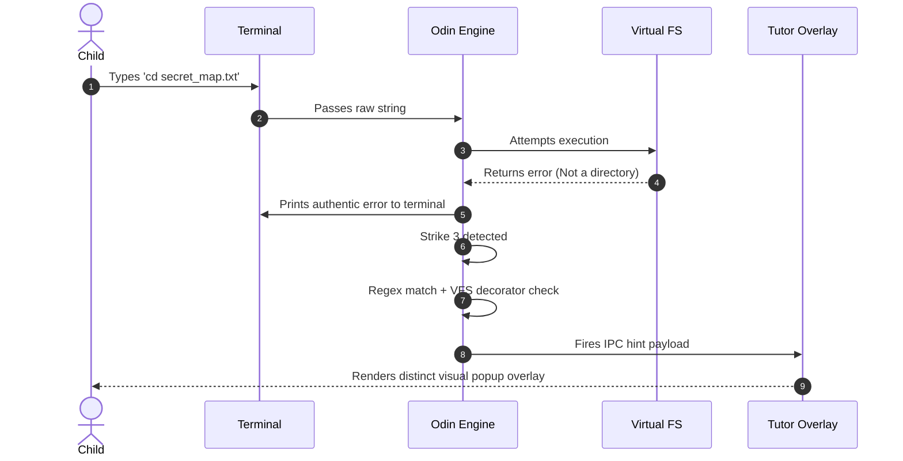
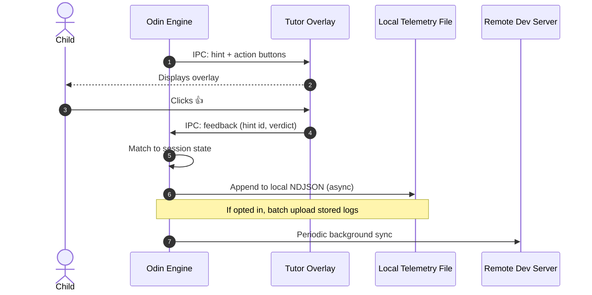
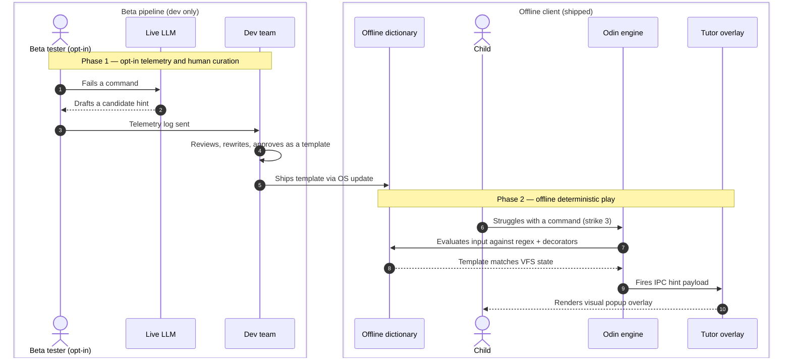

# Omarchy Flish: Architecture

## 1. System overview

Omarchy Flish is a native, sandboxed educational terminal environment that
teaches children command-line logic safely. Instead of connecting a real shell
to a live, hallucination-prone LLM, it uses a deterministic engine to evaluate
commands against a Virtual File System (VFS), and translates struggle into
learning via out-of-band, Socratic hints.

The system is three components with hard boundaries between them. They live in
one repository today and are laid out so each can be split into its own
repository later without touching the others.

| Component | Directory | Language | Future repo |
|---|---|---|---|
| Core engine — REPL, VFS sandbox, strike state, telemetry | `engine/` | Odin | `omarchy-flish` |
| Tutor UI — Omarchy 4 desktop overlay | `tutor/` | QML (Quickshell plugin) | `omarchy-flish-tutor` |
| Template dictionary — regex, VFS decorators, Socratic copy | `templates/` | JSON | `omarchy-flish-templates` |
| Curation tooling — dev-only, never shipped | `tools/curate/` | Python/shell + prompts | stays with the engine |

The only thing that crosses the engine/tutor boundary is
[`docs/ipc-protocol.md`](ipc-protocol.md). The only thing that crosses the
engine/templates boundary is [`templates/schema/`](../templates/schema).

## 2. Core mechanics: the "read the error" pedagogy

Terminal errors are never suppressed. To teach real resilience, the child must
learn to read standard system output.

- `cd file.txt` prints the authentic error: `flish: cd: file.txt: Not a directory`.
- Severe button-mashing (`asdfgh` repeatedly) triggers a simulated `SIGINT`
  (`^C`), cancelling the input and dropping the child at a fresh, clean prompt
  to clear cognitive overload.
- The tutor never replaces the terminal error. It appears out-of-band on the
  desktop and *translates* the error into a Socratic question.

The "No-Do" coaching constraint: the tutor may only ask; the child must type.
Hint bodies never contain a copyable command line.

## 3. Execution sequence



## 4. Two-way IPC and telemetry

The overlay carries "Helpful 👍" and "Confusing 👎" buttons. Feedback returns
over the same duplex connection, is written locally first to avoid network
latency in the child's session, and is optionally synced in the background.



Telemetry and state are written to XDG state, never the working directory:

```
$XDG_STATE_HOME/omarchy-flish/telemetry.ndjson   # default ~/.local/state/...
$XDG_STATE_HOME/omarchy-flish/state.json
```

Sync is **off by default** and opt-in. A child-facing product must not phone
home without an explicit, adult-granted decision.

## 5. The hint curation lifecycle

To run instantly on low-end hardware without a multi-gigabyte local LLM, Flish
ships a fixed dictionary of hand-reviewed hints. Live LLMs are used only in
internal development and by opt-in beta testers, as a **drafting aid**: they
propose candidate wording, a developer edits and approves it, and the approved
text is committed as a static JSON template.

> **This is authoring, not distillation.** No model is trained, fine-tuned, or
> derived at any point. The artifact is a reviewed lookup table written by
> people, not a set of weights. The distinction matters legally as well as
> technically — see [`../NOTICE.md`](../NOTICE.md).



The LLM system prompts used in phase 1 live in
[`tools/curate/prompts/`](../tools/curate/prompts). They are **developer
tooling**: they are never read by the engine, never packaged, and never reach a
child's machine.

Phase 1 produces telemetry from children. How that data may and may not be
used — including the request that it never be used as training data — is set
out in [`../NOTICE.md`](../NOTICE.md).

## 6. Decision log

See [`decisions.md`](decisions.md).
